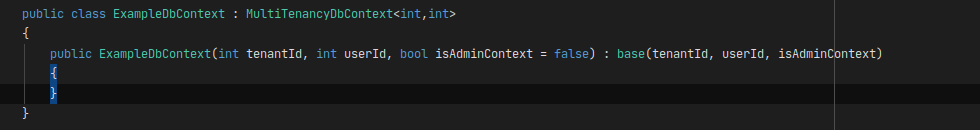
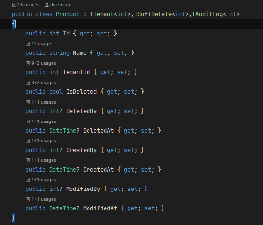
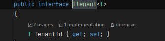
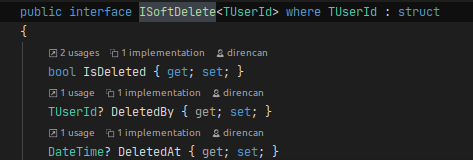
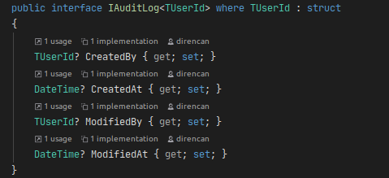

<!-- PROJECT LOGO -->
<br />
<p align="center">
    

  <h3 align="center">Extended Multi Tenancy</h3>

  <p align="center">
    Kolay Multi Tenant Uygulama Yönetimi
    <br />
    <a href="https://github.com/direncancatalkaya/ExtendedMultiTenancy"><strong>Döküman Görüntüle »</strong></a>
    <br />
    <br />
    ·
    <a href="https://github.com/direncancatalkaya/ExtendedMultiTenancy/issues">Bug Bildir</a>
    ·
    <a href="https://github.com/direncancatalkaya/ExtendedMultiTenancy/issues">Geliştirme Önerisi Yap</a>
  </p>
</p>

<!-- TABLE OF CONTENTS -->
## İçerik

* [Proje Hakkında](#proje-hakkında)
* [Gereklilikler](#gereklilikler)
* [Kurulum](#kurulum)
* [Kullanım](#kullanım)
* [Data Isolation](#multi-tenancy-data-isolation)
* [Soft Delete](#soft-delete)
* [Audit Log](#audit-log)
* [Yol Haritası](#yol-haritası)
* [Lisans](#lisans)
* [İletişim](#iletişim)


<!-- ABOUT THE PROJECT -->
## Proje Hakkında

  Bu kütüphane Ef core eklentisi olarak, multi tenant sistemlerin ortak ihtiyaçları için geliştirilmektedir.Data isolation, soft delete pattern ve auditlog işlemleri için çözüm sunar. Açık kaynaktır. İstediğiniz şekilde kendi sisteminiz içerisinde geliştirmeye devam edebilir. Kodlar üzerinde değişiklik yapıp kullanabilirsiniz.


## Gereklilikler

-- Entity Framework Core

## Kurulum

1. Paketi nuget üzerinden yüklemek için
```sh
dotnet add package DRN.EntityFramework.ExtendedMultiTenancy
```

<!-- USAGE EXAMPLES -->
## Kullanım

Paketi yükledikten sonra, DbContext'inizi "MultiTenancyDbContext" classından base alacak şekilde yapılandırın.
class 2 adet generic parametre alır. TenantId parametresi, sisteminizdeki kiracıların primary key tipidir. int, long veya Guid olması uygun olacaktır.
UserId parametresi, kullanıcı hesaplarının primary key tipidir yine int, long veya Guid olması uygun olacaktır.
isAdminContext parametresini true yaparak, sistemdeki bütün özellikleri devre dışı bırakabilir, anlık olarak normal dbcontext gibi kullanabilirsiniz.
Sistem size entity classlarınızda kullanmak üzere interfaceler sağlayacaktır. Entitylerinizi bu classlardan base alarak,
interfacede geçen özelliği otomatize edilmiş şekilde kullanmaya başlayabilirsiniz.

<p align="center">
    
</p>

<p align="center">
    
</p>

 NOT : Her seferinde interfacelerdeki generic parametreleri doldurmak zorunda değilsiniz. Parametre tiplerini belirledikten sonra sistem interfacelerinden belirlenmiş parametrelerle base alan interfaceler üretip kendi sisteminiz için oluşturabilirsiniz.


## Multi Tenancy Data isolation

Multi tenant özelliğe sahip olan entity classlarınızı ITenant interfaceinden base aldırmanız yeterlidir. Bundan sonra database add ve update işlemlerinde otomatik olarak nesne, işlemi o anda yapan tenanta ait olacak ve sorgularda sadece o tenanta görünecektir.

<p align="center">
    
</p>

## Soft Delete

Soft Delete özelliğe sahip olan entity classlarınızı ISoftDelete interfaceinden base aldırmanız yeterlidir. Bundan sonra, silme işlemlerinde otomatik olarak silinen nesnenin isdeleted özelliği true olacak ve çekilen sorgularda gözükmeyecektir. Silme işlemini yapan userid ve işlem tarihinide tutar. Eğer silinen nesneye erişmek isterseniz çekilen sorguda, .IgnoreQueryFilters() fonksiyonunu kullanabilirsiniz. 

Dikkat !! : IgnoreQueryFilters fonksiyonunu kullanmak multi tenant filtrelemesinide kaldıracaktır. "(TenantId == CurrentTenantId)" benzeri eklemeyi yapmayı unutmayın.

<p align="center">
    
</p>

## Audit Log

Audit log tutmak istediğiniz entity classlarınızı IAuditLog interfaceinden base aldırmanız yeterlidir. Ekleme tarihi, Ekleyen userId, Güncelleme tarihi, Güncelleyen userId otomatik olarak tutulacaktır.


<p align="center">
    
</p>

<!-- ROADMAP -->
## Yol Haritası

[Bilinen Hatalar](https://github.com/direncancatalkaya/ExtendedMultiTenancy/issues)  Önerilen geliştirmeler ve bilinen hatalar.


<!-- LICENSE -->
## Lisans

MIT Lisansı altında dağıtılmaktadır. Daha fazla bilgi için "LİSANS" bölümüne bakın.

<!-- CONTACT -->
## Iletişim

Direncan Çatalkaya  - direncan.catalkaya@gmail.com

Project Link: [https://github.com/direncancatalkaya/ExtendedMultiTenancy](https://github.com/direncancatalkaya/ExtendedMultiTenancy)


<!-- MARKDOWN LINKS & IMAGES -->
<!-- https://www.markdownguide.org/basic-syntax/#reference-style-links -->
[contributors-shield]: https://img.shields.io/github/contributors/direncancatalkaya/ExtendedMultiTenancy.svg?style=flat-square
[contributors-url]: https://github.com/direncancatalkaya/ExtendedMultiTenancy/graphs/contributors
[forks-shield]: https://img.shields.io/github/forks/direncancatalkaya/ExtendedMultiTenancy.svg?style=flat-square
[forks-url]: https://github.com/direncancatalkaya/ExtendedMultiTenancy/network/members
[stars-shield]: https://img.shields.io/github/stars/direncancatalkaya/ExtendedMultiTenancy.svg?style=flat-square
[stars-url]: https://github.com/direncancatalkaya/ExtendedMultiTenancy/stargazers
[issues-shield]: https://img.shields.io/github/issues/direncancatalkaya/ExtendedMultiTenancy.svg?style=flat-square
[issues-url]: https://github.com/direncancatalkaya/ExtendedMultiTenancy/issues
[license-shield]: https://img.shields.io/github/license/direncancatalkaya/ExtendedMultiTenancy.svg?style=flat-square
[license-url]: https://github.com/direncancatalkaya/ExtendedMultiTenancy/blob/master/LICENSE.txt
[linkedin-shield]: https://img.shields.io/badge/-LinkedIn-black.svg?style=flat-square&logo=linkedin&colorB=555
[linkedin-url]: https://linkedin.com/in/direncancatalkaya
